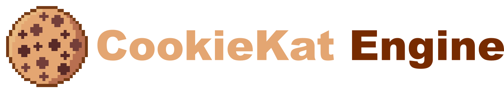
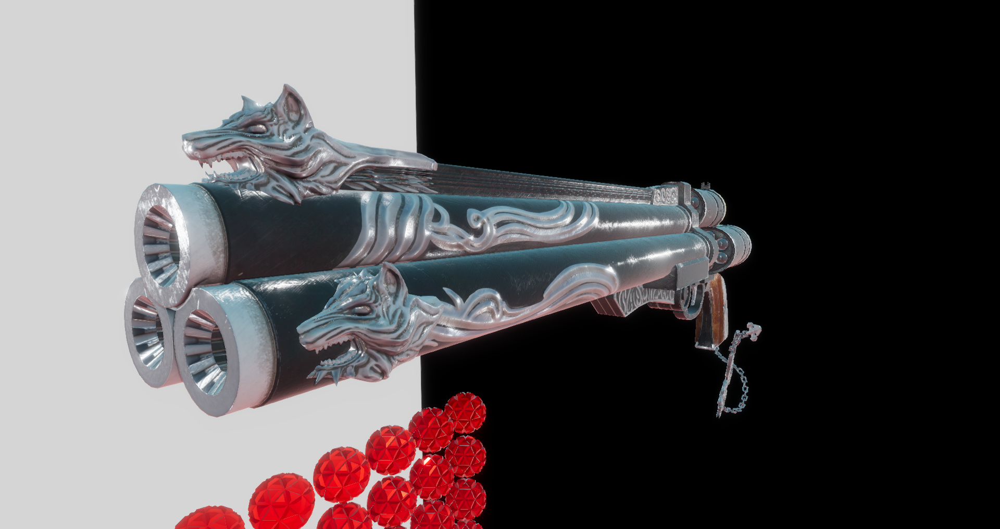
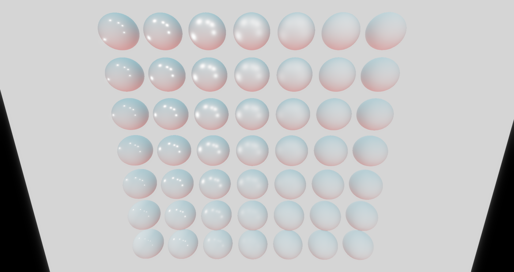

# CookieKat

CookieKat Engine is an experimental prototype C++ game engine / framework. Its intended as programming practice sandbox and an educational tool.

# Features
* Entities
  * Archetype-based Entity Component System
  * Focus on High Performance
  * Simple Handle-Based API
  * Optional Object-Oriented Wrapper
* Rendering
  * Deferred Pipeline
  * FrameGraph for High-Level Rendering Code
  * PBR Material System
    * Cook-Torrance Specular + Lambertian Diffuse BRDFs
  * Vulkan Backend
  * Platform Render API Abstraction
  * SSAO and HDR Bloom Post-processing + ACES* Tonemapping
  * Diffuse IBL (Specular part In-Progress)
  * Indirect Light Baking (In-Progress)
* Resources
  * Async Asset Loading
  * Asset Conversion / Compilation
  * CLI Resource Compiler
  * PBR Materials, Meshes, Textures, Pipelines...
  * Shader Reflection Powered by SPIRV-Reflect
* Framework
  * Modular Design
  * Binary Serialization
  * Memory Management Tools
  * Logging Utilities
  * Testing Tools powered by GoogleTest
  * Profilling Powered by Optick
  * Task System Powered By EnkiTS

# Showcase

Model used: https://sketchfab.com/3d-models/cerberusffvii-gun-model-by-andrew-maximov-d08c461f8217491892ad5dd29b436c90

# Building
This project uses CMake to generate the necessary Visual Studio solution files. The "SETUP_X64_BUILD.bat" file generates the solution using the default configuration.

# Assets
Heavy asset files are not included in this repository, if you want to compile and run the project you must download the asset dependencies from the following Google Drive link: 

# Third-Party
All of the thirdparty projects used by the engine are embeded in this repository, alongside with their specific licenses.

# References
This engine is inspired by the following projects:
* Exoterica: https://github.com/BobbyAnguelov/Esoterica
* Wicked Engine: https://github.com/turanszkij/WickedEngine
* Dilligent Engine: https://github.com/DiligentGraphics/DiligentEngine
* Fillament: https://github.com/google/filament
* BGFX: https://github.com/bkaradzic/bgfx
* Bevy: https://github.com/bevyengine/bevy
* EnTT: https://github.com/skypjack/entt
* Flecs: https://github.com/SanderMertens/flecs
